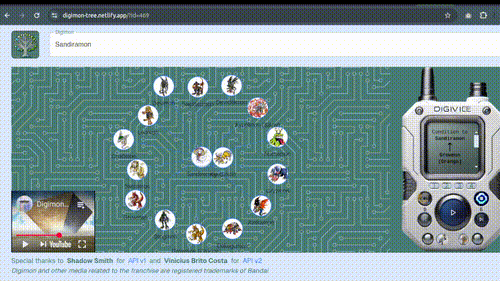

#  Table of Contents
- [🔍 Motivation](#motivation)
- [⚙️ Technologies in this project](#technologies-in-this-project)
- [💻 Running the Project Locally](#running-the-project-locally)

## 🔍 Motivation
Digimon has always fascinated me, especially when it comes to their evolution.
Even though I remember that in the PlayStation games, Digimon never worked quite like Pokémon, I used to think of it as more of a Pokémon subgenre. This summer, while re-watching Digimon Adventure, a lot of questions came to mind. So, I started developing an interface in my free time using the [amazing Digimon API](https://digimon-api.com/) developed by [Vinicius Brito Costa](https://github.com/Vinicius-Brito-Costa) to present all their data in the best way I could. The results were mind-blowing! If I had known half of this as a kid, I wouldn’t have been so confident about what was “right” or “wrong” when debating with friends. The visual representation of their evolution showed me that while a favorite Digimon might follow a certain beloved evolution path, as seen in the anime, it could also follow thousands of other lineages (for better or for worse…). This made me realize that trying to apply Pokémon’s biological evolution approach to Digimon evolution might have confused things for me back then. Now, all I can say is, "I was so wrong!"

## ⚙️ Technologies in this project
This project leverages front-end technologies like [React](https://reactjs.org/logo-og.png), [Next.js](https://nextjs.org/static/favicon/favicon-32x32.png), and [Tailwind CSS](https://tailwindcss.com/favicon-32x32.png) for building responsive and interactive user interfaces. It uses [MUI](https://mui.com/static/logo.svg) and [ShadCN](https://shadcn.dev/favicon.ico) for pre-built components, [Radix UI](https://radix-ui.com/favicon.ico) for accessibility and UI patterns, and [Axios](https://axios-http.com/favicon.ico) for API calls. For state management and data fetching, [React Query](https://tanstack.com/query/favicon.ico) is used alongside the [React Context API](https://reactjs.org/logo-og.png). Testing is handled with [Jest](https://jestjs.io/img/jest-logo-128x128.png) and [React Testing Library](https://testing-library.com/img/logo.svg), and [TypeScript](https://www.typescriptlang.org/favicon.ico) ensures type safety throughout the codebase.


## 💻 Running the project locally
This is a [Next.js](https://nextjs.org) project bootstrapped with [`create-next-app`](https://nextjs.org/docs/app/api-reference/cli/create-next-app).

You can run it locally by installing the dependencies with
```bash
npm i
# or
yarn
```

Then, run the development server:

```bash
npm run dev
# or
yarn dev
```

Open [http://localhost:3000](http://localhost:3000) with your browser to see the result.
